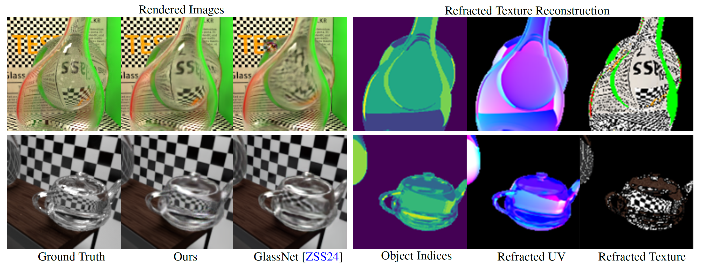

# CrystalNet: Texture-Aware Neural Refraction Baking for Global Illumination

Neural rendering bakes global illumination and other computationally costly effects into the weights of a neural network, allowing
to efficiently synthesize photorealistic images without relying on path tracing. In neural rendering approaches, G-buffers obtained
from rasterization through direct rendering provide information regarding the scene such as position, normal, and textures to
the neural network, achieving accurate and stable rendering quality in real-time. However, due to the use of G-buffers, existing
methods struggle to accurately render transparency and refraction effects, as G-buffers do not capture any ray information from
multiple light ray bounces. This limitation results in blurriness, distortions, and loss of detail in rendered images that contain
transparency and refraction, and is particularly notable in scenes with refracted objects that have high-frequency textures. In this
work, we propose a neural network architecture to encode critical rendering information, including texture coordinates from
refracted rays, and enable reconstruction of high-frequency textures in areas with refraction. Our approach is able to achieve
accurate refraction rendering in challenging scenes with a diversity of overlapping transparent objects. Experimental results
demonstrate that our method can interactively render high quality refraction effects with global illumination, unlike existing
neural rendering approaches.




## Table of Contents
- [Installation](#installation)
- [Training](#training)
- [Evaluation](#evaluation)
- [Project Structure](#project-structure)
- [Acknowledgements](#acknowledgements)
- [Citation](#citation)

## Installation

CrystalNet requires Python 3.10+ along with several dependencies, which can be installed as follows:

```bash
git clone https://github.com/ziyangz5/CrystalNet.git
cd CrystalNet
pip install -r requirements.txt
```

### Dependencies
- Python 3.10+
- PyTorch
- torchvision
- numpy
- matplotlib
- scikit-learn

## Datasets

For dataset generation, please refer to [suzuran-renderer](https://github.com/ziyangz5/suzuran-renderer).

## Training

### 1. Refraction Buffer Generator Training
To train the R-buffer generator, which predicts UV coordinates and object indices, run:
```bash
python train_refraction_buffer_generator.py --scene_name {NAME} --single_batch_size {SIZE} --num_epochs {EPOCHS}
```

### 2. Neural Renderer Training
To train the CrystalNet rendering model:
```bash
python train_renderer.py --scene_name {NAME} --single_batch_size {SIZE} --num_epochs {EPOCHS}
```

### Model Checkpoints
Checkpoints are automatically saved in the `models/` directory every few epochs. These can be loaded later for evaluation.

## Evaluation

Evaluate a pre-trained model on validation or test sets by running:

```bash
python eval_refraction_buffer_generator.py --scene_name {NAME} --single_batch_size {SIZE} --num_epochs {EPOCHS} --checkpoint_path {PATH}
```

or

```bash
python eval_renderer.py --scene_name {NAME} --single_batch_size {SIZE} --num_epochs {EPOCHS} --checkpoint_path {PATH}
```


## Citation

If you use this code or find this work useful, please consider citing:

```bibtex
@article{Zhang2024CrystalNet,
  title={CrystalNet: Texture-Aware Neural Refraction Baking for Global Illumination},
  author={Z. Zhang and E. Simo-Serra},
  journal={Computer Graphics Forum},
  volume={43},
  number={7},
  year={2024},
  doi={10.1111/cgf.15227}
}
```

